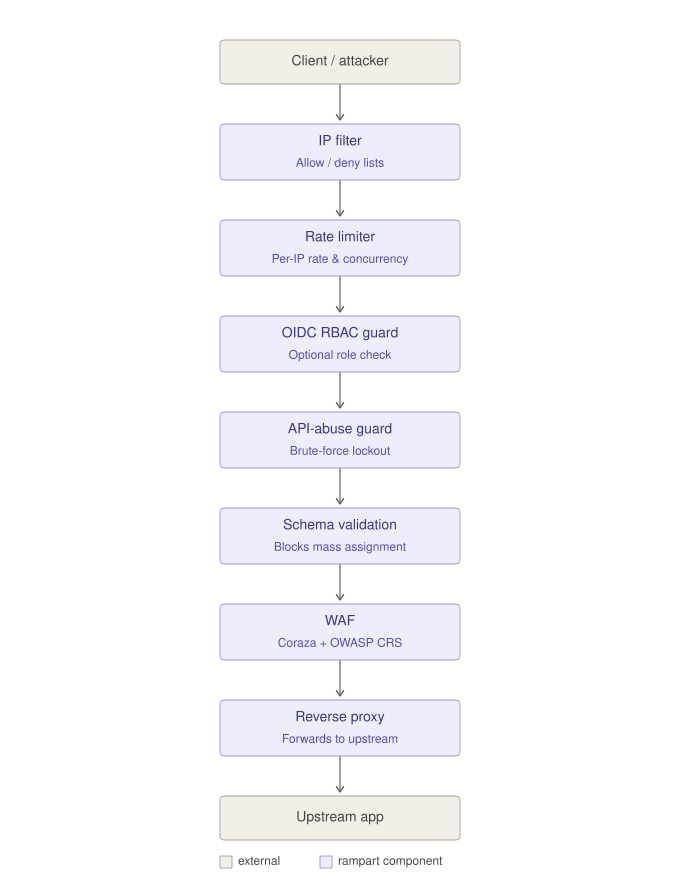

# Rampart

[](https://github.com/singhmarch86/rampart/actions/workflows/ci.yml)
[](LICENSE)

A self-hosted firewall in one Go binary: a WAF (Coraza + OWASP Core Rule Set),
rate limiting, brute-force lockout, JSON Schema request validation, optional
OIDC role enforcement, and a live attack dashboard. Rampart sits in front of
your application as a reverse proxy and blocks attacks at the network,
application and API layers, then shows you what was blocked and why.

**[Full documentation index →](DOCUMENTATION.md)**

## Try it in a minute

```sh
git clone https://github.com/singhmarch86/rampart && cd rampart
docker compose up
```

That runs Rampart in front of OWASP Juice Shop, a deliberately vulnerable app.
Attack it at `http://localhost:8080` (try a SQL injection in the search box)
and watch what gets blocked on the dashboard at `http://localhost:9090`.
To protect your own app instead, see [Quick start](#quick-start) below.

## Evidence, not claims

- **Benchmarked against ModSecurity** with GoTestWAF: 63.12% vs 63.27% at
  baseline (within noise), 65.25% with one custom rule. Numbers and
  reproduction steps: [benchmarks/RESULTS.md](benchmarks/RESULTS.md).
- **16 bugs, vulnerabilities and doc errors found in Rampart itself** during
  development, each with root cause, fix and how the fix was verified:
  [docs/FINDINGS.md](docs/FINDINGS.md).
- **It says what it can't do.** Network-layer attacks like MITM and DNS
  spoofing, and phishing are outside what an L7 proxy can see:
  [docs/DETECTION.md](docs/DETECTION.md#out-of-scope-on-purpose-networktransport-layer-attacks).

## How a request flows



## Why

Most teams stitch together nginx + ModSecurity + fail2ban + a log pipeline +
a dashboard to get this. Rampart aims to ship it as one binary with sane
defaults, so a small team gets WAF + rate-limiting + analytics without
assembling five tools.

## Status

Early development. Not production-ready yet. See [docs/ROADMAP.md](docs/ROADMAP.md)
and [docs/FINDINGS.md](docs/FINDINGS.md) for every bug/vulnerability found in
Rampart itself during development and how it was fixed.

## Scope

- **Network layer** — IP allow/deny lists, per-IP rate and concurrency limits, request read/idle timeouts, real-client-IP resolution behind a load balancer (`trusted_proxies`), optional TLS termination. Not implemented: geo-blocking, volumetric DDoS protection (see [docs/NETWORK_HARDENING.md](docs/NETWORK_HARDENING.md) for where that belongs).
- **Application layer (WAF)** — OWASP Top 10 detection via the Coraza engine + OWASP Core Rule Set
- **API / mobile-backend layer** — credential-stuffing detection, token-abuse detection, request-schema validation
- **Analytics** — attack timeline, top attackers, rule-hit dashboard. See [docs/DETECTION.md](docs/DETECTION.md) for how each layer decides what counts as an attack.
- **Offline attack triage** — `rampart-analyze` turns a window of the block-event log into a Markdown report (top attackers, multi-vector IPs, traffic bursts), optionally narrated by an LLM. Separate binary, no dependency in the core proxy. See [docs/ANALYZE.md](docs/ANALYZE.md) for what it can and can't tell you.
- **Cloud-native** — Docker image, Helm chart, Terraform module
- **OIDC integration** — dashboard login and API role/permission enforcement against an existing identity provider (Keycloak, Auth0, Okta, ...). Rampart integrates with an IdP; it does not replace one. See [docs/OIDC.md](docs/OIDC.md).

## License

Apache 2.0 — see [LICENSE](LICENSE). The core engine is and will remain free
and open source. A hosted analytics console (multi-node management, longer
retention, threat-intel feed) is planned as a paid add-on; it will never be
required to run the core firewall.

## Quick start

```sh
go build -o bin/rampart ./cmd/rampart
cp configs/rampart.example.yaml configs/rampart.yaml
# edit configs/rampart.yaml: set upstream to the app you're protecting
./bin/rampart -config configs/rampart.yaml
```

Rampart listens on `listen` (default `:8080`) and proxies allowed traffic to
`upstream`. Every block decision (IP filter, rate limit, or WAF) is written
as a JSON line to `logging.events_path`.

## Progress

- [x] **Phase 1** — network-layer core (reverse proxy, IP allow/deny, rate limiting, event log)
- [x] **Phase 2** — application WAF (Coraza + OWASP CRS, custom SecLang rules, verified live against OWASP Juice Shop). See [benchmarks/](benchmarks/) for GoTestWAF results.
- [x] **Phase 3** — API/mobile-backend abuse detection: credential-stuffing/token-abuse blocking (`api_abuse`) and JSON Schema request validation (`schema_validation`), both verified live against Juice Shop's real login endpoint.
- [x] **Phase 4** — live attack-analytics dashboard (`dashboard.enabled`): top attacker IPs, top block reasons, a per-minute timeline, and a live event feed over Server-Sent Events. Runs on its own port (no auth yet, so keep it off a public interface — see the config comments). Verified live in a browser against real multi-layer traffic.
- [x] **Phase 5** — cloud-native packaging: Docker image (distroless, non-root), `docker compose` demo stack, a Helm chart (standalone/sidecar/ingress patterns, `helm lint`+`helm template` verified), and a Terraform module for AWS ECS Fargate. See [docs/DEPLOYMENT.md](docs/DEPLOYMENT.md).
- [x] **OIDC integration** (`oidc.*`) — dashboard login and API role/permission enforcement against an existing IdP. Verified live against a real Keycloak instance (full browser-based Authorization Code + PKCE flow, real realm/client/roles/user), not just mocks. See [docs/OIDC.md](docs/OIDC.md).
- [x] **Phase 6** — community release: CI (build/vet/test-race/gofmt/Helm lint on every push), [SECURITY.md](SECURITY.md), [CONTRIBUTING.md](CONTRIBUTING.md), issue/PR templates, [CHANGELOG.md](CHANGELOG.md).

Full detail in [docs/ROADMAP.md](docs/ROADMAP.md).

## Community

- **Found a bug?** [Open an issue](../../issues/new/choose).
- **Found a security vulnerability?** Do *not* open a public issue — see [SECURITY.md](SECURITY.md).
- **Want to contribute?** See [CONTRIBUTING.md](CONTRIBUTING.md).
- Governed by the [Code of Conduct](CODE_OF_CONDUCT.md).
